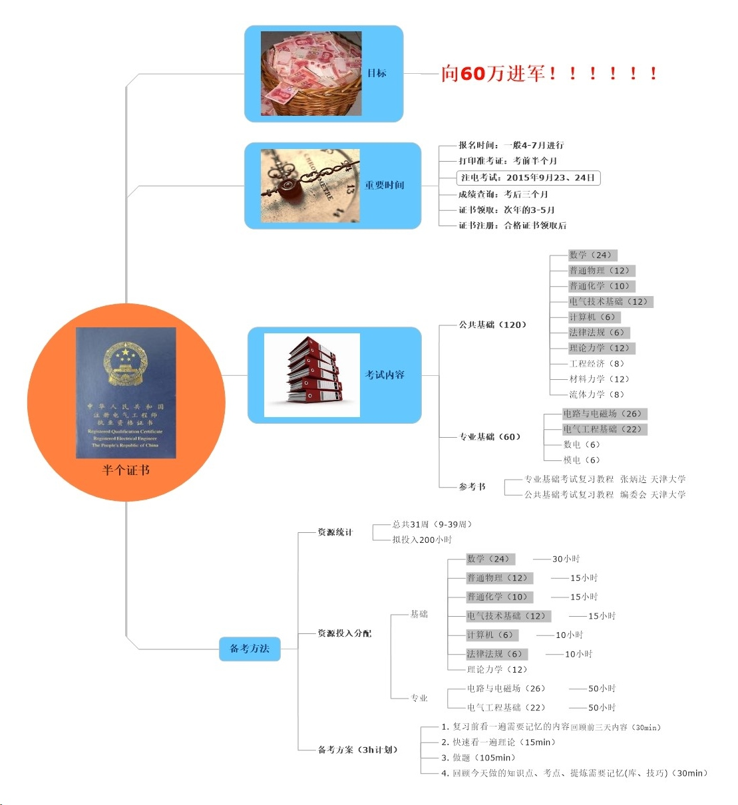

#零.前言
#一、2017我的期待
##【奔跑吧少年】构建个人成长管理系统（抓手思维）
1. 价值：
    - 抓手思维：积累、促进其他期望达成
    - 作品声音：一本书
    - 以教促学：老婆会用
    - 临界知识：精通一系列模型工具
2. 目标：
    - 整理（必须精品）加书写精品文章50篇（包含20个模型、20个流程）；
    - 老婆分享20次（以教促学）
    - 制定11个月目标，45次周计划，完成200天时间记录与反思日记（习惯性行为）
##【我爱我家】家庭和睦幸福（后盾）
1. 价值
    - 媳妇与妈关系融洽
    - 乐乐健康快乐(V170503.学习叨叨魏的课程)
    - 父母幸福
    - 一本影集
2. 目标
    - 学习PS与手机摄影，拍摄500张照片并处理50张形成一张影集
    - 选10个话题与父母聊
    - 学习叨叨魏课程(V170503)
##【领导我行】提升履职能力（基础）
1. 价值
    - 掌握协调优化技术
    - 得到领导认可
        - 能耗诊断
        - 博后课题验收
        - 院士项目
    - 职场积累势能
    - ~~提高职称~~<已完成20170414>
    - 钱
2. 目标
    - ~~高质量完成职称汇报~~<已完成20170414>
    - 博后课题验收优
    - 完成柳州优化
    - 论文2篇
    - 专利2个
    - 按计划完成院士课题
##【半个证书】注册电气工程师基础考试（主动出击）
1. 价值
    - 学到一些知识
    - 考到40%以上
    - 得到半个证书
2. 目标
    - 分析考试（学什么？学到什么程度？怎么学？）
    - 会做一半多题
    - 近十年题掌握70%
    - 保证200小时投入(每周大约7小时)
    - 关注信息、参加考试

#二、期待澄清
##【奔跑吧少年】构建个人成长管理系统（抓手思维）
1. 可以向我具体描述一下您明年的期待吗？
    奔跑吧少年：战略能力、产品能力、媒体能力、运营能力
2. 这些期待对于你来说为什么这么重要？（追问，完成8条）
    - 从战略到战术的整体提升
    - 抓手思维，带动其他期待实现
    - 增强自己的认知宽度，加强深度
    - 跳出负价值区
    - 助力老婆个人成长
    - 不仅知道，还要做到
3. 如果你做到/得到/看到什么，就可以代表你的期待实现了？（追问并确认）
    - 形成个人成长体系，得到一张流程图，写一本书（作品声音）
    - 得到一些列模型、工具并应用于生活（临界知识）
    - 一年的时间记录，高效能做正确的事，年、月、周目标回顾（抓手思维）
    - 老婆开始应用一部分系统（以教促学）
    - 其他期待至少达成两个（抓手思维）
4. 为了实现这些期待，你大约要做哪些事情呢？（追问并确认）
    - 学习超级个体、成甲说书、果果、坨坨等课程；
    - 知晓-理解-使用-应用-评估-创新，刻意练习
    - 写书
    - 给老婆分享理论、提供工具
    - 时间记录、晨间反思
5. 每件事大约要做到什么样的标准？（追问并确认）
    - 课程主题阅读+分析阅读，整理（必须精品）加书写精品文章50篇（包含20个模型、20个流程）；
    - 工具、模型医用，说到哪一部分立马说出理论，给出工具及应用方法；
    - 11次月目标，45次周计划，200天时间记录与反思日记
    - 老婆分享20次
6. 你觉得完成这些事需要有哪些资源支撑？（追问并确认）
    - 得到；永澄系列文章，永澄系列课学院笔记。
##【领导我行】提升履职能力（基础）
1.  可以向我具体描述一下你明年的期待吗？
    - 领导我行
2. 这些期待对你来说为什么这么重要？（追问，完成8条）
    - 家庭的基础
    - 个人职场发展的保障
    - 提升专业能力，换工作筹码
    - 自由职业态的基础
3. 如果你做到/得到/看到什么，就可以代表你的期待实现了？（追问并确认）
    - 掌握协调优化技术
    - 得到领导认可
        - 能耗诊断
        - 博后课题验收
        - 院士项目
    - 职场积累势能
    - 提高职称
    - 钱
4. 为了实现这些期待，你大约要做哪些事情呢？（追问并确认）
    - 协调优化学习
    - 准备验收材料
    - 准备高工答辩
    - 写2篇论文
    - 写2个专利
    - 推进院士项目
    - 能耗诊断与技术监督
5. 每件事大约要做到什么样的标准？（追问并确认）
    - 精通协调，2号机达到1号机的指标
    - 资料完备，ppt逻辑性好，理论强，有亮点
    - 突出自己能力
    - 至少一篇录用
    - 提交专利
    - 项目完全依照计划进度完成
    - 熟悉现场工作与设备，达到能挑毛病的水平
6. 你觉得完成这些事需要有哪些资源支撑？（追问并确认）
    - 张秋生、胡轶群1、2号逻辑
    - 王富强去年材料
    - 数据库、网络
##【我爱我家】家庭和睦幸福（后盾）
1.  可以向我具体描述一下你明年的期待吗？
    我爱我家  幸福 = 意义+快乐
2. 这些期待对你来说为什么这么重要？（追问，完成8条）

3. 如果你做到/得到/看到什么，就可以代表你的期待实现了？（追问并确认）
    - 媳妇与妈关系融洽
    - 媳妇成长<抓手>
    - 乐乐健康快乐成长
    - 父母、岳父母幸福
    - 夫妻恩爱
    - 一本影集
4. 为了实现这些期待，你大约要做哪些事情呢？（追问并确认）
    - 学PS及摄影，给家人拍更多好照片，制作2017家人影集
    - 让父母有意义感
    - 给媳妇分享学习
    - 与家人交流
    - 陪乐乐看书
    - 过节回岳父家看看
    - 给晚辈买书
5. 每件事大约要做到什么样的标准？（追问并确认）
    - 影集至少包含50张后期处理过的照片，且每张照片有一句话
    - 与父母交流，网上搜集为父母做10件事儿
    - 陪乐乐时不想其他，全身心投入
6. 你觉得完成这些事需要有哪些资源支撑？（追问并确认）
    - 家人的支持，知道我的期待
##【半个证书】注册电气工程师基础考试（主动出击）
1.  可以向我具体描述一下你明年的期待吗？
    - 半个证书：注册电气工程师基础
2. 这些期待对你来说为什么这么重要？（追问，完成8条）
    - 挣钱
    - 为自由职业态提供资本
    - 换工作的资本
    - 专业知识学习
    - 证明自己
    - 锻炼自己学习能力
    - 学到一些临界知识
3. 如果你做到/得到/看到什么，就可以代表你的期待实现了？（追问并确认）
    - 参加考试
    - 考到40%以上
    - 学到一些知识、掌握一些知识
4. 为了实现这些期待，你大约要做哪些事情呢？（追问并确认）
    - 分析考试（学什么？学到什么程度？怎么学？）
    - 备考
    - 关注考试
    - 参加考试
5. 每件事大约要做到什么样的标准？（追问并确认）
    - 学到什么程度？会做题
    - 投入200小时
    - 成功参加考试
6. 你觉得完成这些事需要有哪些资源支撑？（追问并确认）
    - 时间支持（每周大约7小时）

