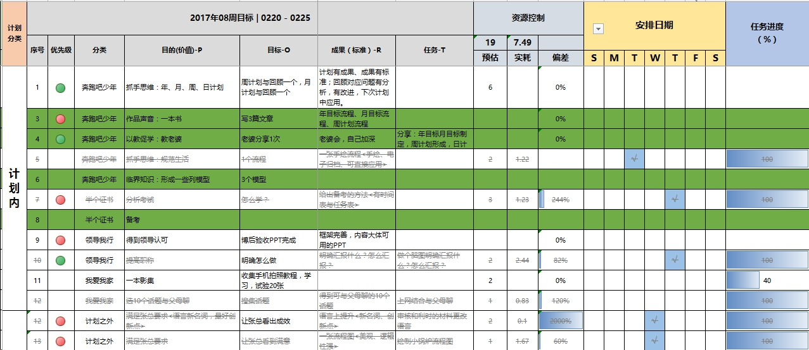
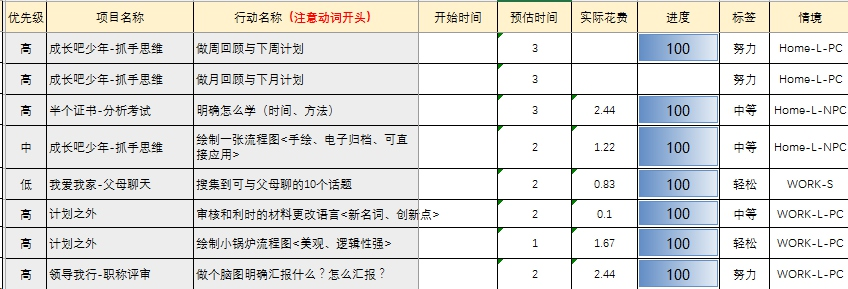
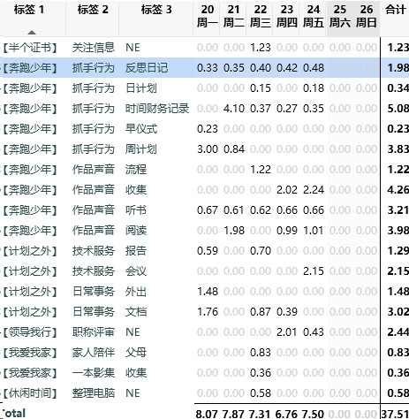
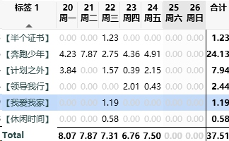

>总结时间：2017.2.26.16：00

#一、任务完成情况

2017年08周周回顾（0220--0226）
2017年08周任务分解及执行情况（0220--0226）

2017年08周时间花费记录（0220--0226）
#二、总结

#三、本周小确幸
##1、重新整理了时间标签
依照年期待整理了时间标签，但是执行过程感觉稍微有点儿少（特别是计划外的好多事感觉标签不够用）
##2、整理了一个流程
讲上周有一天的一个反思日记整理了流程，但是并不是很完美
#四、下周工作计划